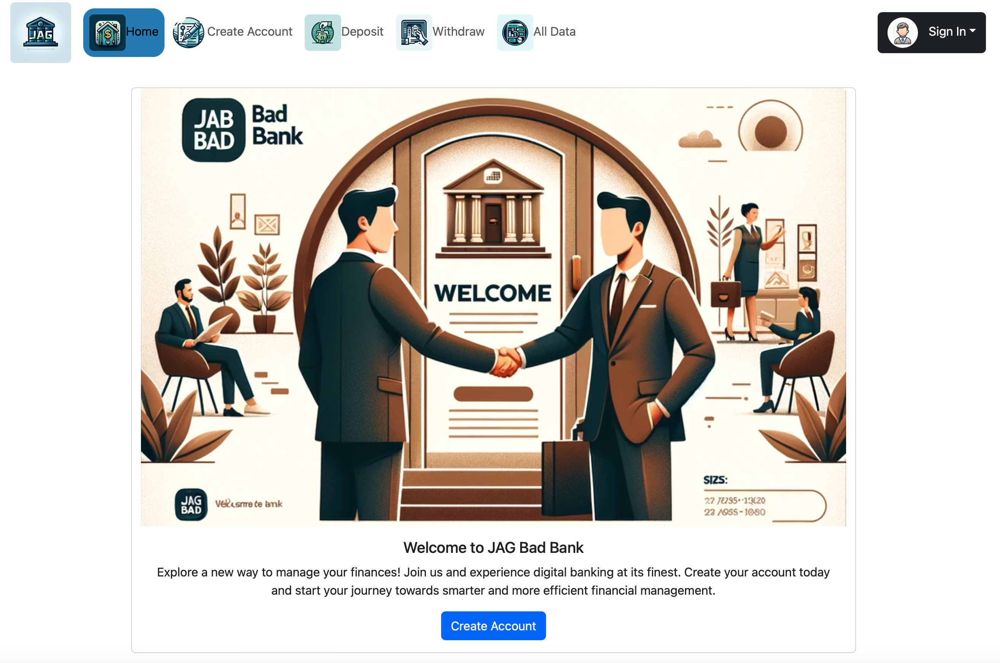

# JAGV Bad Bank

JAGV Bad Bank: Revolutionizing Digital Banking

## Description/Motivation
JAGV Bad Bank is a cutting-edge web application designed to transform the way users manage their banking transactions. Built with the latest technologies, including React, this project aims to provide a seamless and intuitive banking experience. Whether it's for personal use or to cater to small businesses, JAGV Bad Bank helps users effortlessly conduct banking activities such as account creation, deposits, withdrawals, and monitoring transaction history. The motivation behind this project was to simplify banking processes, make financial management accessible to everyone, and solve the common issues faced by traditional banking systems through technology.

## Features

- **Secure Account Creation**: Register with confidence through our secure authentication system.
- **Instant Deposits**: Add funds to your account seamlessly with real-time balance updates.
- **Easy Withdrawals**: Withdraw funds safely, with built-in checks to ensure you have sufficient balance.
- **Comprehensive Transaction History**: Keep track of all your banking activities with our detailed transaction log.
- **Responsive and Accessible**: Enjoy a consistent banking experience across all devices.

## Future Features

- **Mobile App**: Extend functionality with a dedicated mobile application for iOS and Android.
- **Voice Commands**: Perform transactions through voice-activated commands for added convenience.
- **Investment Services**: Explore investment opportunities directly through your banking dashboard.

## Technologies Used

- **Frontend**: React
- **Build Tool**: Vite
- **Navigation**: React Router
- **Styling**: Bootstrap
- **State Management**: UserContext

## Installation Guidelines

1. **Clone the repository**:
   ```
   git clone https://github.com/josegzzv/JAGVBadBank.git
   ```
2. **Navigate to the project directory**:
   ```
   cd jag-bad-bank
   ```
3. **Install dependencies**:
   ```
   npm install
   ```
4. **Launch the application**:
   ```
   npm run dev
   ```

## Usage

Visit `http://localhost:3000` in your browser to start managing your banking needs with ease. Navigate through the app to access different features such as account creation, making deposits, and more.

## Screenshots



Gallery Coming Soon.

Stay tuned for updates as we will be adding a screenshot gallery to showcase the application in action.

## Contributing

We welcome contributions to make JAGV Bad Bank even better. Follow these steps to contribute:

1. Fork the project.
2. Create your feature branch (`git checkout -b feature-AmazingFeature`).
3. Commit your changes (`git commit -m 'Add some AmazingFeature'`).
4. Push to the branch (`git push origin feature-AmazingFeature`).
5. Open a Pull Request.

## License

JAGV Bad Bank is proudly licensed under the MIT License. See the [LICENSE](LICENSE) file for more details.

## Contact

For any questions or suggestions, feel free to contact Jose Gzz at josegzzv@msn.com.
